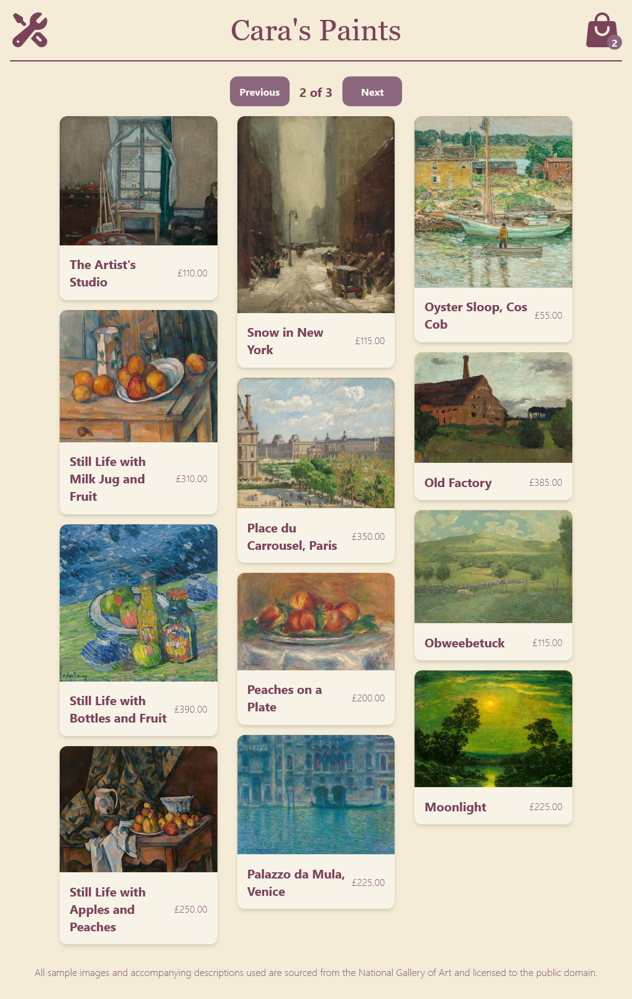

# react-art-shop
An Art Shop application developed with React, Vite & Tailwind CSS for a responsive mobile-first front-end, utilising Node.js & MySQL for a REST API backend. Created from specifications provided in a university class.

## Preview

## Attribution
- Sample images and accompanying descriptions used are sourced from the National Gallery of Art and licensed to the public domain.